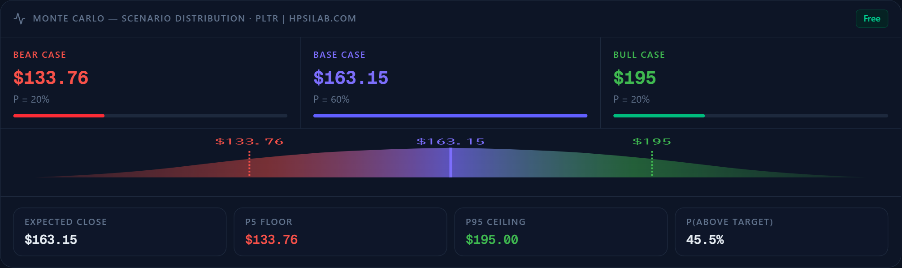

# HPSILab Quant Finance MCP Server for Stock & Options Analytics

<!-- mcp-name: io.github.haiyunsky/hpsilab-quant-finance-mcp -->

HPSILab is an open-source Python quantitative finance MCP server for research on US equities, ETFs, and supported options. It brings stock signals, implied volatility, options analytics, Monte Carlo simulation, AI prediction, backtesting, and risk analysis into ChatGPT, Claude, Cursor, VS Code, and other MCP clients. Connect once, ask in natural language, and receive structured results that an assistant can compare and explain.

[Get a Free API Key](https://hpsilab.com/register) · [Pricing](https://hpsilab.com/pricing) · [Python SDK](https://pypi.org/project/hpsilab-mcp/)

> Research and educational use only. HPSILab does not provide investment advice and does not execute trades.
[](https://pypi.org/project/hpsilab-quant-finance-mcp/)
[](https://github.com/haiyunsky/hpsilab-quant-finance-mcp/actions/workflows/ci.yml)
[](LICENSE)

Current package and server version: **0.8.7**. An unpackaged source checkout
identifies itself as `0.8.7+source` so initialization metadata and outbound
User-Agent values never fall back to `0.0.0`.

### Monte Carlo research example



Example visualization of scenario-based Monte Carlo research output. Results depend on the selected inputs and model assumptions. See [`get_monte_carlo`](docs/tools.md#get_monte_carlo) for tool details.

## Quick start: Official Remote MCP

The hosted Streamable HTTP service is recommended and requires no local installation. The following is a Claude Code `.mcp.json` example; other clients use different configuration schemas, documented below.

```json
{
  "mcpServers": {
    "hpsilab": {
      "type": "http",
      "url": "https://hpsilab.com/mcp",
      "headers": {
        "Authorization": "Bearer hpsi_your_key"
      }
    }
  }
}
```

1. [Register a free account](https://hpsilab.com/register), sign in, and generate an API key from Settings.
2. Replace `hpsi_your_key` in your client's private MCP configuration. Never commit or paste a real key into chat.
3. Connect the server and verify it with:

```text
Use HPSILab to analyze AAPL. Separate observed metrics from interpretation,
identify conflicting signals, and finish with a concise risk summary.
```

All financial research tools require a valid API key. See [client setup](https://github.com/haiyunsky/hpsilab-quant-finance-mcp/blob/main/docs/client-setup.md) and [authentication](https://github.com/haiyunsky/hpsilab-quant-finance-mcp/blob/main/docs/authentication.md) for details.

If the key is missing, the package stops locally before constructing the
downstream client or sending a request:

```json
{
  "error": "api_key_required",
  "message": "A free API key is required.",
  "register_url": "https://hpsilab.com/register",
  "docs_url": "https://hpsilab.com/developer/v2"
}
```

401 and 402 responses are never retried. A 429 is retried only when it carries
a valid `Retry-After`. Read-only calls use a finite retry budget for timeouts
and recoverable 500/502/503/504 responses; artifact-producing calls are not
automatically retried.

The local SDK adapter also applies Free-tier safeguards per API key: 20
requests per tool per UTC day, 100 total requests per UTC day, and 10 total
requests per rolling minute. Anonymous callers have zero tool requests. Each
actual downstream attempt, including a retry, consumes one local allowance.
Counters are process-local; the hosted API remains authoritative across
process restarts and machines.

## Quick start: Local stdio

For clients that require local stdio:

```bash
pip install -U hpsilab-quant-finance-mcp
```

With `HPSILAB_API_KEY` configured, direct Python usage is:

```python
import os
from dotenv import load_dotenv
load_dotenv()

HPSILAB_API_KEY = os.getenv("HPSILAB_API_KEY")
if not HPSILAB_API_KEY:
    raise RuntimeError("HPSILAB_API_KEY is not configured")

print("HPSILAB_API_KEY is configured")

import hpsilab_quant_finance_mcp
from hpsilab_quant_finance_mcp import server

print(hpsilab_quant_finance_mcp.__version__)

result = server.get_ai_prediction("NVDA")
print(result)
```

For MCP, add the stdio server to the client's private configuration. This example uses the `mcpServers` schema supported by Claude and Cursor; VS Code and GitHub Copilot use a `servers` schema instead.

```json
{
  "mcpServers": {
    "hpsilab": {
      "command": "hpsilab-quant-finance-mcp",
      "env": {
        "HPSILAB_API_KEY": "hpsi_your_key"
      }
    }
  }
}
```

Then verify it through the MCP client:

```text
Use HPSILab to get the AI prediction for NVDA and summarize the model consensus.
```

The client discovers tools with MCP `tools/list` and invokes them with `tools/call`. See [local setup](https://github.com/haiyunsky/hpsilab-quant-finance-mcp/blob/main/docs/self-hosting.md) and [Python usage](https://github.com/haiyunsky/hpsilab-quant-finance-mcp/blob/main/docs/python-sdk.md).

## Why HPSILab

HPSILab gives assistants typed inputs, structured outputs, ticker validation, machine-readable errors, and dedicated tools instead of invented metrics. It supports US-listed equities, ETFs, and supported options data; coverage and limits depend on the hosted service and plan.

## Tools

The public product surface contains **9 public financial research tools**.

| Tool | What it returns | Behavior |
| --- | --- | --- |
| `analyze_stock` | Aggregate directional and quantitative stock analysis | Read-only |
| `get_ai_prediction` | Next-session prediction, confidence, and model consensus | Read-only |
| `get_iv_radar` | IV level, rank, percentile, skew, and regime | Read-only |
| `get_option_pressure` | Max pain, gamma walls, expected move, and pressure zones | Read-only |
| `get_monte_carlo` | 30-day simulated distribution and probabilities | Read-only |
| `get_equity_curve` | Strategy backtests and risk-adjusted performance | Read-only |
| `get_pretrade_risk_scan` | Position, exposure, correlation, and risk checks | Read-only |
| `generate_stock_images` | Hosted stock and options chart artifacts | Creates an artifact; not idempotent |
| `generate_stock_research_report` | Structured Markdown research report and timestamp | Creates an artifact; not idempotent |

Research tools accept one exchange ticker such as `NVDA`, `SPY`, or `BRK.B`; company names are not accepted. Live results can change between calls. Artifact tools can consume quota and should not be retried automatically.

Full inputs, outputs, side effects, and tool-selection guidance are in [docs/tools.md](https://github.com/haiyunsky/hpsilab-quant-finance-mcp/blob/main/docs/tools.md).

## Copy-ready prompts

### Claude

```text
Use HPSILab to analyze NVDA. Summarize the directional signal, AI model
consensus, IV regime, options pressure, 30-day Monte Carlo range, and the
three most important risks. Distinguish tool data from interpretation.
```

### Cursor

```text
Use HPSILab's IV radar and option-pressure tools for SPY. Compare IV rank,
percentile, skew, expected move, max pain, gamma wall, and pressure zones.
Return a compact table and do not recommend a trade.
```

### ChatGPT

```text
Run the HPSILab pre-trade risk scan for TSLA. Explain every warning or failed
check, preserve unavailable fields as unavailable, and quote the returned
reason instead of guessing. Do not execute or recommend a trade.
```

Setup guidance covers ChatGPT, Claude, Cursor, VS Code, GitHub Copilot, Continue, and Kimi. See the [client setup guide](https://github.com/haiyunsky/hpsilab-quant-finance-mcp/blob/main/docs/client-setup.md) for each client's transport and configuration format.

## Safety and license

HPSILab is for research and education only. Outputs may be incomplete, delayed, or wrong and are not investment, financial, or trading advice. The MCP server has no brokerage connectivity, order entry, or trade-execution capability.

Licensed under the [MIT License](LICENSE). Contributions are welcome; read [AGENTS.md](AGENTS.md) and [CONTRIBUTING.md](CONTRIBUTING.md) before proposing public schema changes.
