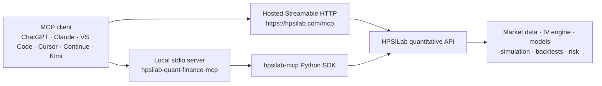

# HPSILab Quant Finance MCP

<!-- mcp-name: io.github.haiyunsky/hpsilab-quant-finance-mcp -->

**Production-focused quantitative research for US stocks and options, available directly inside ChatGPT, Claude, VS Code, GitHub Copilot, Cursor, Continue, Kimi, and other MCP clients.**

HPSILab combines stock signals, implied volatility, options positioning, Monte Carlo scenarios, strategy backtests, pre-trade risk checks, charts, and research reports behind ten purpose-built MCP tools. Ask a question in natural language and receive structured data that an assistant can explain, compare, and use in a larger research workflow.

> Research and educational use only. HPSILab does not execute trades and does not provide investment advice.

[](https://pypi.org/project/hpsilab-quant-finance-mcp/)
[](https://github.com/haiyunsky/hpsilab-quant-finance-mcp/actions/workflows/ci.yml)
[](LICENSE)
[](https://registry.modelcontextprotocol.io/)

**Hosted endpoint:** `https://hpsilab.com/mcp`

```text
Analyze NVDA with HPSILab. Summarize the directional signal, IV regime,
options pressure, 30-day Monte Carlo range, and the three most important risks.
```

[Quick start](#quick-start) · [Client guides](#supported-mcp-clients) · [Prompt library](#example-prompts) · [Tool reference](#tools)

<!-- Screenshot placeholder: replace with a real client conversation showing an NVDA analysis. -->
> **Screenshot placeholder — end-to-end stock analysis in an MCP client**

## Why this server exists

General-purpose assistants can explain finance, but they should not invent live metrics or silently mix data from incompatible sources. HPSILab provides a narrow, explicit tool contract for quantitative research:

- structured outputs instead of prose that must be scraped;
- specialized tools for volatility, options positioning, probability, backtests, and risk;
- consistent ticker validation and machine-readable errors;
- clear read-only and side-effect annotations for MCP clients;
- the same research surface through hosted Streamable HTTP and local stdio transports.

The project is designed for investors, options researchers, quantitative developers, financial research teams, and agent builders who need evidence-rich analysis—not automated trading.

## Features

- **Unified stock analysis** — combine multiple quantitative signals into a bull, bear, or neutral view.
- **AI prediction** — inspect next-session direction, probability, confidence, regime, and model consensus.
- **Implied-volatility radar** — evaluate ATM IV, IV rank, percentile, skew, and volatility regime.
- **Options pressure** — identify max pain, gamma walls, expected moves, squeeze targets, and strike concentrations.
- **Monte Carlo simulation** — explore 30-day price distributions and downside probabilities.
- **Strategy backtests** — compare returns, Sharpe and Sortino ratios, drawdown, and win rate.
- **Pre-trade risk scan** — review volatility, beta, VaR, drawdown, sizing, exposure, and correlation checks.
- **Research artifacts** — generate structured reports and hosted chart images.
- **Self-service onboarding** — an agent can register its own account and obtain an API key without a password, a wallet, or a web form.
- **Agent-friendly contract** — typed inputs, structured dictionaries, stable tool names, and explicit MCP annotations.

## Quick Start

The hosted Streamable HTTP endpoint is the recommended path. It requires no local Python installation and always exposes the current server version.

1. Create an account at [hpsilab.com](https://hpsilab.com) and generate an API key in Settings.
2. Add this remote MCP server to your client:

   ```text
   https://hpsilab.com/mcp
   ```

3. Send the header `Authorization: Bearer hpsi_your_key` if the client supports custom headers.
4. Ask:

   ```text
   Use HPSILab to analyze AAPL. Separate observed metrics from interpretation,
   identify conflicting signals, and finish with a concise risk summary.
   ```

**An API key is required** — the hosted endpoint no longer serves any tool anonymously. Don't have one yet? Skip the sign-up page: call the `register_account` tool (available on the hosted endpoint and in this package alike) with an email address and it hands back a real `hpsi_` key immediately, no password, wallet, or web form. The account is bound to the caller server-side, so later calls from the same client are recognised even before you've set `HPSILAB_API_KEY`. It starts unverified (a reduced daily allowance) until you confirm the emailed link, which unlocks the full Free plan. See [Getting an API key without leaving your client](#getting-an-api-key-without-leaving-your-client) below.

## Installation

### Option A: hosted MCP service (recommended)

Configure your client with the endpoint and bearer header shown above. See the client-specific guides below for exact steps.

### Option B: local stdio server

The local package delegates calculations to the HPSILab API through the `hpsilab-mcp` SDK, so it always requires network access. It also needs an API key for the nine analysis tools — but you do not need to obtain one beforehand: install the package, then call `register_account` (see [Getting an API key without leaving your client](#getting-an-api-key-without-leaving-your-client)).

```bash
pip install -U hpsilab-quant-finance-mcp
```

Use your API key:

```python
from hpsilab_quant_finance_mcp import server

server.api_key = "hpsi_xxxxxxxxxxxxxxxxx"

result = server.get_iv_radar("NVDA")
print(result)
```

macOS or Linux:

```bash
export HPSILAB_API_KEY=hpsi_your_key
hpsilab-quant-finance-mcp
```

Windows PowerShell:

```powershell
$env:HPSILAB_API_KEY = "hpsi_your_key"
hpsilab-quant-finance-mcp
```

For clients that support `uvx`, use:

```text
command: uvx
args: hpsilab-quant-finance-mcp
environment: HPSILAB_API_KEY=hpsi_your_key
```

### Option C: install from source

```bash
git clone https://github.com/haiyunsky/hpsilab-quant-finance-mcp.git
cd hpsilab-quant-finance-mcp
python -m venv .venv
python -m pip install -e .
```

Set `HPSILAB_API_KEY`, then run `hpsilab-quant-finance-mcp`.

### Local Streamable HTTP

The same ten tools can be served locally over the standard HTTP transport without duplicating business logic:

```bash
hpsilab-quant-finance-mcp --transport streamable-http --host 127.0.0.1 --port 8000
```

Connect a client to `http://127.0.0.1:8000/mcp`. This development mode uses the process-level `HPSILAB_API_KEY`; keep it bound to loopback unless you have configured production TLS, authentication, allowed hosts/origins, and trusted proxy behavior.

### Python REST SDK

Applications that need direct Python/REST access rather than MCP should use the separate [`hpsilab-mcp`](https://pypi.org/project/hpsilab-mcp/) package. The REST SDK and this MCP server are related products, but they are not interchangeable transports.

## Supported MCP clients

| Client | Hosted HTTP | Local stdio | Guide |
| --- | :---: | :---: | --- |
| ChatGPT | Yes | No | [ChatGPT setup](docs/chatgpt.md) |
| Claude / Claude Code / Claude Desktop | Yes | Yes | [Claude setup](docs/claude.md) |
| VS Code | Yes | Yes | [VS Code setup](docs/vscode.md) |
| GitHub Copilot | Yes | Yes | [Copilot setup](docs/copilot.md) |
| Cursor | Yes | Yes | [Cursor setup](docs/cursor.md) |
| Continue | Yes | Yes | Use the client's MCP configuration UI with the endpoint above |
| Kimi Code | Yes | Yes | Use Streamable HTTP or `uvx` with the settings above |

MCP capabilities and configuration formats evolve. Use the linked guides and your client's current documentation if a UI label has changed.

## Example prompts

### Fast stock research

```text
Use HPSILab to analyze MSFT. Give me the overall signal, confidence, strongest
bullish and bearish evidence, and any disagreement between the underlying models.
```

### Options and volatility

```text
Use HPSILab to evaluate TSLA options. Compare IV rank and percentile with the
expected move, max pain, gamma wall, and pressure zones. Do not recommend a trade.
```

### Risk-first workflow

```text
Run the HPSILab pre-trade risk scan for NVDA. Explain every warning or failed
check, show how portfolio exposure changes, and state when data is unavailable.
```

More copy-ready workflows:

- [Stock analysis](examples/stock_analysis.md)
- [Options and volatility](examples/options.md)
- [Earnings research](examples/earnings.md)
- [Portfolio research](examples/portfolio.md)
- [Risk scans](examples/risk_scan.md)

## Screenshots

The following placeholders identify the product views that should be captured before the next documentation release. Screenshots must use non-sensitive demo data and must not expose an API key or account information.

<!-- Screenshot placeholder: multi-signal stock analysis response. -->
> **Placeholder 1 — multi-signal stock analysis response**

<!-- Screenshot placeholder: IV radar and options-pressure comparison. -->
> **Placeholder 2 — implied volatility and options positioning**

<!-- Screenshot placeholder: pre-trade risk scan with warnings. -->
> **Placeholder 3 — risk scan and portfolio impact**

## Architecture



This repository owns the MCP interface and its stdio/Streamable HTTP adapters. The `hpsilab-mcp` SDK owns hosted REST paths and downstream API transport behavior used by the shared service layer.

Detailed engineering references:

- [Architecture and authentication boundaries](docs/architecture.md)
- [MCP protocol compatibility review](docs/protocol-compatibility.md)
- [Phase 2 migration notes](docs/migration-phase-2.md)

## Tools

Tool names are part of the public compatibility contract and are not renamed casually.

| Tool | Purpose | Side-effect profile |
| --- | --- | --- |
| `analyze_stock` | Aggregate directional and quantitative stock analysis | Read-only, idempotent |
| `get_ai_prediction` | Next-session model prediction and consensus | Read-only, idempotent |
| `get_iv_radar` | IV level, rank, percentile, skew, and regime | Read-only, idempotent |
| `get_option_pressure` | Max pain, gamma walls, expected move, and pressure zones | Read-only, idempotent |
| `get_monte_carlo` | Thirty-day simulated price distribution and probabilities | Read-only, idempotent |
| `get_equity_curve` | Strategy backtests and risk-adjusted performance | Read-only, idempotent |
| `get_pretrade_risk_scan` | Position, portfolio exposure, and correlation risk checks | Read-only, idempotent |
| `generate_stock_images` | Create hosted chart artifacts | Creates artifacts; not idempotent |
| `generate_stock_research_report` | Create a structured hosted research report | Creates an artifact; not idempotent |
| `register_account` | Create a free account and receive an API key | Creates an account; not idempotent |

The nine analysis tools each accept an exchange ticker such as `NVDA`, `AAPL`, `SPY`, or `BRK.B`. Company names are not accepted in place of tickers. Live outputs can change between calls. Artifact-producing tools may consume quota, and generated image URLs can expire.

### Getting an API key without leaving your client

Every analysis tool requires `HPSILAB_API_KEY` and returns a `missing_api_key`
error without one. `register_account` is the exception, and the reason it
exists: it is the one tool that works *without* a key, because its purpose is
to obtain one.

```
register_account("you@example.com")
```

No password, no wallet, no web form. It returns a real `hpsi_` key — set it as
`HPSILAB_API_KEY` and the other tools authenticate as that account.

The account is created **unverified**, which keeps the anonymous daily
allowance until the emailed link is confirmed; confirming it unlocks the full
Free plan. Use an address someone actually reads.

Calling again returns the same account and a fresh key rather than creating a
second one, so it is safe to retry if a key was lost. An address that already
belongs to a different account is refused — you cannot attach yourself to
someone else's account by guessing their email.

## FAQ

### Is HPSILab a trading bot?

No. It provides quantitative research data and analysis tools. It does not place, route, or manage orders.

### Do I need an API key?

For the nine analysis tools, yes: the local stdio package reads `HPSILAB_API_KEY`, and the hosted endpoint requires one too — there is no free anonymous access on either transport.

But you do not need to have one already. `register_account` is available on **both** the local package and the hosted endpoint, and it is the one tool that works without a key — call it with an email address and it returns a real key, with no password, wallet, or web form. An agent can do this unattended.

### What markets are supported?

The current tool surface is designed for US-listed equities, ETFs, and their supported options data. Coverage is governed by the hosted service and account tier.

### Why did the server reject a company name?

Tools require an exchange ticker. Use `NVDA`, not `NVIDIA`; use `BRK.B` where the exchange ticker includes a class suffix.

### Why are exposure or correlation fields empty?

Those sections depend on an existing tracked watchlist or portfolio. When unavailable, the response includes `available: false` and a `reason`; clients should surface that reason instead of guessing.

### Why did a chart or report call run twice?

Artifact-producing tools are deliberately marked non-idempotent. Repeating a call can create another artifact or consume quota. Review client approval prompts before retrying.

### How do I troubleshoot a connection?

Confirm the endpoint is exactly `https://hpsilab.com/mcp`, verify the bearer header or `HPSILAB_API_KEY`, restart the MCP server after configuration changes, and inspect your client's MCP logs. Client-specific checks are in the linked setup guides.

### Is the output investment advice?

No. Outputs are for research and education and can be incomplete, delayed, or wrong. Independently verify material facts and consult a qualified professional where appropriate.

## Contributing

Contributions that improve reliability, interoperability, tests, documentation, and developer experience are welcome.

1. Read [AGENTS.md](AGENTS.md) for the repository contract.
2. Read [CONTRIBUTING.md](CONTRIBUTING.md) for setup, testing, and pull-request expectations.
3. Open an issue before proposing a new tool or any public schema change.
4. Keep changes backward compatible and include tests for observable behavior changes.

Please report vulnerabilities privately according to [SECURITY.md](SECURITY.md), and follow the [Code of Conduct](CODE_OF_CONDUCT.md).

## License

[MIT](LICENSE) © 2026 Haiyun Hu
