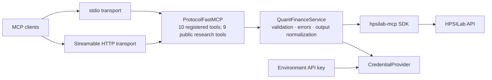

# Architecture

## Design goals

The server has one public MCP tool surface, one reusable service adapter, and two standard transports. Transport selection must never duplicate quantitative logic or change tool schemas.



## Module responsibilities

### `server.py`

- owns MCP server metadata and tool registration;
- The server currently registers 10 tools: 9 public research tools and one compatibility-only `register_account` tool.
- converts structured service errors into MCP `CallToolResult` objects with `isError: true`;
- selects stdio or Streamable HTTP at process startup;
- exposes an ASGI app factory for external HTTP hosting.

Tool functions remain thin and call `_service.call(...)`. They do not construct REST URLs or duplicate downstream transport code.

### `service.py`

- validates and normalizes ticker symbols;
- obtains credentials through a provider interface;
- delegates every operation to the official `hpsilab-mcp` SDK;
- maps SDK exceptions into a stable structured error shape;
- adds the backward-compatible `status` and `disclaimer` fields to successful objects.

This service is independent of MCP transport and can be unit-tested without starting a protocol session.

### `auth.py`

`CredentialProvider` is the boundary between service access and credential acquisition. All financial research tools require a valid API key. The current implementation reads `HPSILAB_API_KEY` for stdio and local development, while the Official Remote MCP endpoint receives it as a bearer credential. The compatibility-only `register_account` tool remains registered in code but is not a public product feature or onboarding path. New users register at `https://hpsilab.com/register` and manage keys in Settings.

## Transport selection

The console command remains backward compatible:

```bash
hpsilab-quant-finance-mcp
```

It starts stdio and writes only MCP JSON-RPC messages to stdout.

Local Streamable HTTP can be started with:

```bash
hpsilab-quant-finance-mcp --transport streamable-http --host 127.0.0.1 --port 8000
```

Equivalent environment variables are `HPSILAB_MCP_TRANSPORT`, `HPSILAB_MCP_HOST`, and `HPSILAB_MCP_PORT`. The built-in runner accepts loopback hosts only. The Official MCP SDK supplies session management, protocol-version handling, JSON/SSE negotiation, Origin/Host protection, and lifecycle processing.

`create_http_app()` returns the same server as an ASGI application for deployment behind an approved production host. Production hosting must configure TLS, accepted hosts/origins, authentication, request limits, and trusted proxy behavior explicitly.

## Compatibility contract

- Public tool names and existing parameters are stable.
- Inputs remain flat JSON objects.
- Successful responses retain all SDK fields and add only `status` and `disclaimer` when absent.
- Errors retain the existing structured fields and are also marked `isError: true` at the MCP layer.
- Resources and prompts are currently empty; no finance functionality is duplicated into those surfaces.
- Tool, resource, and prompt catalogs are static, so change notifications are not advertised.
